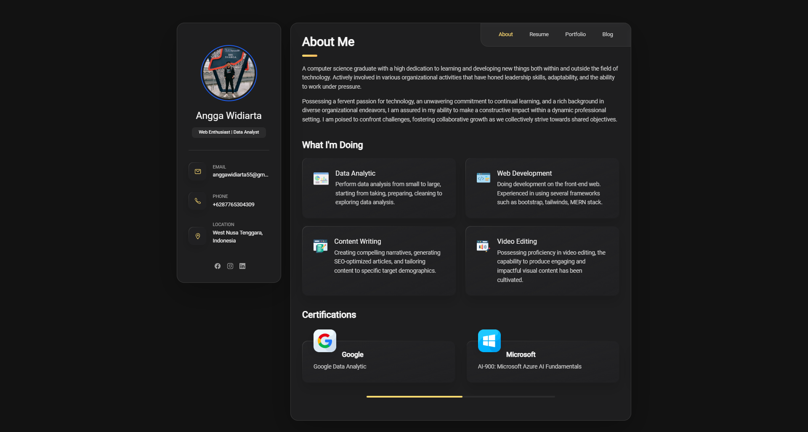

<h1 align="center">


  <br>
    Personal Portfolio
  <br>
</h1>

<h4 align="center">Explore my personal portfolio, meticulously crafted using the cutting-edge <a href='https://astro.build/' target="_blank">Astro</a>.

<br>



<br>

## How To Use

To clone and run this application, you'll need [Git](https://git-scm.com) and [Node.js](https://nodejs.org/en/download/) (which comes with [npm](http://npmjs.com)) installed on your computer. From your command line:

```bash
# Clone this repository
$ git clone git@github.com:anggawidiarta/personal-portfolio.git

# Go into the repository
$ cd personal-portfolio

# Install dependencies
$ npm install

# Run the app
$ npm run dev
```

> **Note**
> If you're using Linux Bash for Windows, [see this guide](https://www.howtogeek.com/261575/how-to-run-graphical-linux-desktop-applications-from-windows-10s-bash-shell/) or use `node` from the command prompt.

## Credits

This software uses the following open source packages:

* [Tailwind](https://tailwindcss.com/)
* [Node.js](https://nodejs.org/)
* [Astro](https://astro.build)
* [Vercel](http://vercel.com)

## License

MIT

---
